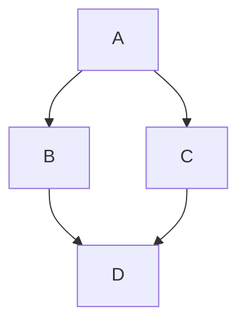

# Report 1: Proposal & Architecture

{: .no_toc }

This page breaks down our proposed project into the mission and scope of the project, the specifications of the robot used, architecture, protocol, and git infestructure.

---

## Table of Contents

{: .no_toc .text-delta }

1. TOC
{:toc}

---

## 1. Missions Statement & Scope

Mission statement
- To create a robot that can be given simple spoken instructions that it then uses to determin the best corse of action and successfully completes the instructions

Scope 
- understanding spoken instructions
- autonomously exploring a room
- detecting and cataloging verbally specified objects
- creating a map of all the cataloged objects
- presenting the map to the user

Success state 
- The robot can successfully be verbally instructed what objects to find then navigate the room with no additional user input while detecting and mapping the location of all specified objects

Enviornment
- 

Primary problem
- 

---

## 2. Technical Specifications

  - Robot Platform: TurtleBot 4
  - Kinematic Model: Declare the model (Differential Drive, Ackermann, or Holonomic).
  - Preception Stack: RPLIDAR A1M8, OAK-D-LITE, IMU, wheel encoder, IR obsticle sensor, IR cliff sensor

--- 

## 3. High Level System Architecture

  - Mermaid Diagram: Provide a visual flow following the Perception, Estimation, Planning and Actuation convention. This diagram must illustrate how data moves through various modules in the system.

User: "Find all red objects"
    ↓
VLN Model: "I should check near desks and shelves"
    ↓
Robot navigates to those areas
    ↓
Camera detects red objects
    ↓
SLAM tracks where the robot is
    ↓
Our code combines: "Red cup found at position X, Y"
    ↓
Repeat until whole room explored
    ↓
Show final map with all red objects marked

  - Module Declaration Table: A table listing every module in your diagram, explicitly labeled as either Library (existing ROS 2 packages) or Custom (code you will write).

  - Module Intent

    - Libraries: Provide a 50-150 word writeup describing the intent behind choosing a specific package for module and the configuration you intend to tune (e.g. max velocity of the differential drive controller).

    - Custom Libraries: Provide a 100-200 word writeup describing the specific algorithm you intend to implement from scratch (e.g., "Implementing a custom RRT* to navigate narrow passages"). Note: This abstract forms the "contract" for your Algorithmic Factor grade.

---

## 4. Safety & Operational Protocol
Define the software Deadman Switch or any timeout logic to prevent hardware damage in the event of communication loss. Describe the specific conditions that trigger a system-wide "E-Stop."

---

## 5. Git Infrastructure
Link to your shared team repository and confirm the Git Submodule setup is active on your individual site.

---

- [ ] Akshaya
- [ ] Moss
- [ ] Nivas