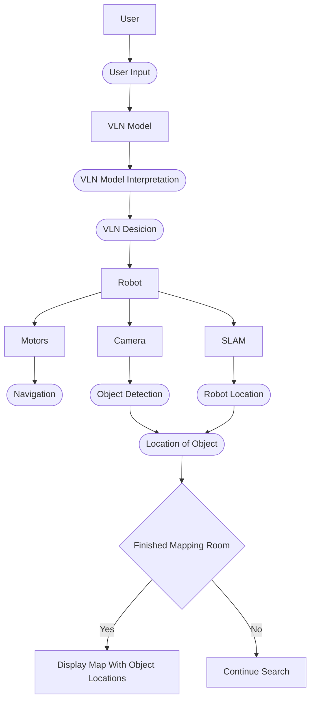

# Report 1: Proposal & Architecture

{: .no_toc }

This page breaks down our proposed project into the mission and scope of the project, the specifications of the robot used, architecture, protocol, and git infestructure.

- [ ] Akshaya
- [ ] Moss
- [ ] Nivas

---

## Table of Contents

{: .no_toc .text-delta }

1. TOC
{:toc}

---

### 1. Mission Statement & Scope

### 1.1 Mission Statement
Our goal is to develop an autonomous mobile robot (Turtle bot 4) capable of understanding natural language commands and use them to explore in the given environment performing semantic exploration tasks. The robot insted of relying on fixed commands, the robot will interpret everyday intructions such as "Find all red objects in the room," using VLN techniques the robot autonomously explore the environment, detect specified objects using computer vision and to match with the given description, and generate an annotated map showing the locations of all discovered items in the given environment.

### 1.2 Scope
The project encompasses the following capabilities:
- **Natural Language Understanding**: Processing verbal instructions to extract the important details to do the search 
- **Autonomous Exploration**: Navigating through the mapped environments using VLN-guided decision making based on the given instructions
- **Object Detection & Classification**: Identifying and cataloging verbally specified objects in real-time using computer vision
- **Semantic Mapping**: Creating spatial maps annotated with object locations and attributes as the robot explores
- **Result Presentation**: The system will present the results by disaplying an annotate map that shows where the relevent objexts were found

### 1.3 Success State
The system successfully accomplishes the following:
- The system will be considered successful when it can reliably understand user instructions and autonomously explore an environment to locate the requested objects
- During operation, the robot should navigate the environment independently without requiring human intervention (unless there is an emergency situation to kill the system manually). Where the system aims to achieve over 85% recall and over 90% precision in object detection
- In addition to detecting objects, the robot marks the positions of discovered objects. The recorded object locations should be accurate within 15 cm of positional error.
- Finally, the robot should complete its exploration efficiently. For a given mapped environment

### 1.4 Environment
The robot will operate in **Lab 225**, a semi-structured indoor environment characterized by:
- The room contains fixed objects, static furniture (desks, chairs, tabels)
- People may move through the environment during operation, introducing temporary obstacles the robot must avoid.
- Lighting conditions may be uneven, noisy due to shadows, reflections, or different light sources, which can affect visual perception
- Textured surfaces for SLAM feature extraction like Walls, floors, and surrounding objects provide enough visual features for SLAM-based localization and mapping.

### 1.5 Primary Problem
Although VLN's has shown promising results has shown promising results in simulated environments, implementing these techniques on real mobile robots presents several practical challenges. This project addresses the challenge of integrating VLN methods into a physical mobile robot system capable of understanding natural language instructions and executing them in a real indoor environment. The goal is to bridge the gap between high-level language-based navigation models and the constraints of real-world robotic operation, enabling the robot to understand instructions, explore its surroundings, detect relevant objects, and map their locations autonomously.
---

## 2. Technical Specifications

Robot Platform: TurtleBot 4

Kinematic Model: Declare the model (Differential Drive, Ackermann, or Holonomic)

Preception Stack: RPLIDAR A1M8, OAK-D-LITE, IMU

--- 

## 3. High Level System Architecture

### 3.1 Mermaid Diagram

### 3.2 Module Declaration Table

  | Module              | Library or Custom |
  |:----------------    |:------------------|
  | VLN Model           | Library           |
  | SLAM                | Library           |
  | Nav2                | Library           |
  | YOLO                | Library           |
  | VLN Integration     | Custom            |
  | Map Builder         | Custom            |
  | Exploration Manager | Custom            |
  | Action Translator   | Custom            |

### 3.3 Module Intent

  #### Libraries: 
    Provide a 50-150 word writeup describing the intent behind choosing a specific package for module and the configuration you intend to tune (e.g. max velocity of the differential drive controller).
    
VLN Model
        
SLAM
        
Nav2
        
YOLO
        

  #### Custom Libraries: 
    Provide a 100-200 word writeup describing the specific algorithm you intend to implement from scratch (e.g., "Implementing a custom RRT* to navigate narrow passages"). Note: This abstract forms the "contract" for your Algorithmic Factor grade.
    
VLN Integration
        
Map Builder
        
Exploration Manager
        
Action Translator
        

---

## 4. Safety & Operational Protocol

### 4.1 Hardware Safety Mechanisms
- **Emergency Stop Button**: A emergency stop button on the software base allows the robot to immediately cut power to the motors if a dangerous situation occurs.
- **Bump Sensors**: Contact sensors detect collisions with obstacles and trigger an immediate stop or slight reversal to avoid damage.
- **Battery Monitoring**: The system continuously monitors battery levels, issuing a low-battery warning at 30% and initiating an automatic return-to-dock procedure when the charge drops to 20%. Also kill switch dsiabled during charging altering the user it's in charging mode.

### 4.2 Software Safety Systems

**Velocity Limits:**
- Maximum linear velocity: 0.2 m/s (chosen to allow stable and safe indoor navigation)
- Maximum angular velocity: 0.5 rad/s
- Acceleration limits: 0.1 m/s² linear, 0.3 rad/s² angular

Note: These values are approximate initial limits. The final velocity and acceleration parameters may be adjusted during testing and experimentation to achieve a balance between safety, stability, and navigation performance.

**Deadman Switch Logic:**
- If no SLAM pose update received for few seconds  → STOP (localization failure)
- If Nav2 reports path planning failure 3 consecutive attempts → STOP and alert the user
- If stuck (id the robot velocity <0.01 m/s for 10 seconds while command is active) → Execute recovery/ return to docking

Note: These thresholds are approximate and may be adjusted based on system performance, computational load, and communication latency during testing to ensure reliable safety behavior in real-world operation.

**Timeout Protocols:**
- VLN model query timeout: 60 seconds (robot will diplay the error message fo the model timeout)
- Navigation timeout: 120 seconds per decision making (then replan or select new goal)
- Total exploration timeout: 25 minutes maximum (prevent battery depletion)

Note: These numbers are approximate and may be adjusted based on system performance, computational load during testing to ensure reliable safety behavior in real-world operation.

**Recovery Behaviors (Graduated):**
1. **Level 1 - Stuck Detection**: If the robot is detected as stuck, it will rotate 180°, back up 0.5m, replan path
2. **Level 2 - Navigation Failure**: Upon navigation failure, the robot will clear its costmap, slightly increase obstacle inflation, and attempt to replan the path if only instructions given by the user
3. **Level 3 - Repeated Failures**: After multiple consecutive failures, the robot will return to its last known good pose(Docking center) and request a new VLN waypoint to continue exploration safely.

Note: The activation of each recovery level may vary depending on environmental conditions, sensor noise, and communication or computation latency during real-world testing.

**E-Stop Trigger Conditions:**
- Emergency button press an immediate stop when the E-Stop button on the softwares ide is pressed.
- Unrecoverable localization failure (no SLAM pose for few seconds, indicating loss of localization)
- Critical sensor failure (If key sensors, such as the LIDAR, stop providing valid data for more than 10 seconds.)
- Navigation system crash detected (Detection of a failure or crash/overload in the navigation stack )

Note: These thresholds are approximate and may be fine-tuned during testing based on real-world sensor behavior, latency, and robot dynamics.

**Operational Safeguards:**
- All navigation goals are checked to ensure they remain within the known map boundaries before execution.
- The costmap is configured with a 0.5 m inflation radius around obstacles to maintain a safe distance during navigation.
- Dynamic reconfigure like emergency parameters (e.g., velocity limits, timeouts) can be adjusted in real-time to respond to unexpected conditions.
- A dedicated watchdog process monitors the health of critical software nodes and automatically restarts any node that crashes to maintain safe and continuous operation.

Note: These safeguards are designed to be adaptable. Their parameters may be adjusted during testing based on environment complexity, sensor performance, and communication or computational latency.

---

## 5. Git Infrastructure
Link to your shared team repository and confirm the Git Submodule setup is active on your individual site.
