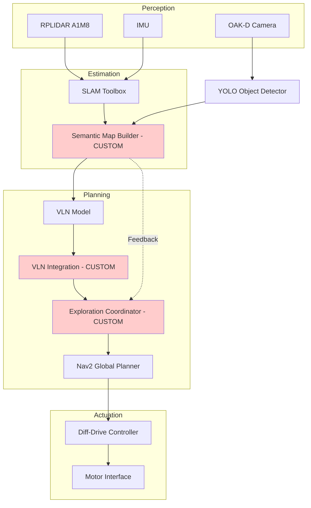

# Report 1: Proposal & Architecture

{: .no_toc }

This page breaks down our proposed project into the mission and scope of the project, the specifications of the robot used, the architecture, the protocol, and the git infrastructure.

---

## Table of Contents

{: .no_toc .text-delta }

1. TOC
{:toc}

---

### 1. Mission Statement & Scope

### 1.1 Mission Statement
Our goal is to develop an autonomous mobile robot (Turtlebot 4) capable of understanding natural language commands and using them to explore the given environment, performing semantic exploration tasks. The robot insted of relying on fixed commands, will interpret everyday instructions such as "Find all red objects in the room," using VLN techniques. The robot autonomously explores the environment, detects specified objects using computer vision, matches with the given description, and generates an annotated map showing the locations of all discovered items in the given environment.

### 1.2 Scope
The project encompasses the following capabilities:
- **Natural Language Understanding**: Processing verbal instructions to extract the important details to do the search 
- **Autonomous Exploration**: Navigating through the mapped environments using VLN-guided decision making based on the given instructions
- **Object Detection & Classification**: Identifying and cataloging verbally specified objects in real-time using computer vision
- **Semantic Mapping**: Creating spatial maps annotated with object locations and attributes as the robot explores
- **Result Presentation**: The system will present the results by displaying an annotated map that shows where the relevant objects were found

### 1.3 Success State
The system successfully accomplishes the following:
- The system will be considered successful when it can reliably understand user instructions and autonomously explore an environment to locate the requested objects
- During operation, the robot should navigate the environment independently without requiring human intervention (unless there is an emergency situation to kill the system manually). Where the system aims to achieve over 85% recall and over 90% precision in object detection
- In addition to detecting objects, the robot marks the positions of discovered objects. The recorded object locations should be accurate within 15 cm of positional error.
- Finally, the robot should complete its exploration efficiently. For a given mapped environment

### 1.4 Environment
The robot will operate in **Lab 225**, a semi-structured indoor environment characterized by:
- The room contains fixed objects, static furniture (desks, chairs, tables)
- People may move through the environment during operation, introducing temporary obstacles that the robot must avoid.
- Lighting conditions may be uneven, noisy due to shadows, reflections, or different light sources, which can affect visual perception
- Textured surfaces for SLAM feature extraction, like Walls, floors, and surrounding objects, provide enough visual features for SLAM-based localization and mapping.

### 1.5 Primary Problem
Although VLN's have shown promising results in simulated environments, implementing these techniques on real mobile robots presents several practical challenges. This project addresses the challenge of integrating VLN methods into a physical mobile robot system capable of understanding natural-language instructions and executing them in real indoor environments. The goal is to bridge the gap between high-level language-based navigation models and the constraints of real-world robotic operation, enabling the robot to understand instructions, explore its surroundings, detect relevant objects, and autonomously map their locations.

---

## 2. Technical Specifications

**Robot Platform:** TurtleBot 4 (Hardware)

**Kinematic Model:** Differential Drive
- Two independently driven wheels
- Non-holonomic constraints
- Forward velocity and angular velocity control

**Perception Stack:**
- **RPLIDAR A1M8**: 360° 2D laser scanner (12m range, 8000 samples/sec)
- **OAK-D Lite**: Spatial AI camera providing RGB images and depth sensing
- **IMU**: Inertial Measurement Unit for orientation and acceleration data
- **Wheel Encoders**: Odometry from Create3 base

--- 

## 3. High-Level System Architecture

### 3.1 Mermaid Diagram


### 3.2 Module Declaration Table

| Module / Node | Functional Domain | Software Type | Description |
|---------------|-------------------|---------------|-------------|
| RPLIDAR Driver | Perception | Library | Acquires 360° laser scan data for obstacle detection and SLAM |
| OAK-D Camera Driver | Perception | Library | Provides RGB images and depth maps from a spatial AI camera |
| IMU Driver | Perception | Library | Supplies orientation and acceleration data |
| YOLO Object Detector | Perception | Library | Pre-trained neural network for real-time object detection |
| SLAM Toolbox | Estimation | Library | Performs simultaneous localization and mapping using laser scans |
| **Semantic Map Builder** | **Estimation** | **Custom** | **Fuses object detections with SLAM pose to create annotated map** |
| VLN Model | Planning | Library | Pre-trained vision-language model for navigation decision-making |
| **VLN Integration** | **Planning** | **Custom** | **Bridges VLN model outputs to ROS navigation stack** |
| **Exploration Coordinator** | **Planning** | **Custom** | **Manages exploration loop and task completion criteria** |
| Nav2 Global Planner | Planning | Library | Computes collision-free paths on occupancy grid |
| Diff-Drive Controller | Actuation | Library | Translates velocity commands to wheel motor controls |

### 3.3 Module Intent

#### Library Modules

**VLN Model (Library – Vision-Language Navigation)**

We will use a pre-trained vision-language model (likely CLIP or a similar embodied AI model) to guide the robot’s exploration intelligently. The VLN model takes three main inputs: the current camera image, the task description (for example, “find red objects”), and the current SLAM map. Using these inputs, it predicts exploration waypoints that are likely to be useful.

This allows the robot to explore in a context-aware manner. Instead of wandering randomly, it can prioritize areas where the target objects are more likely to appear (for instance, looking near desks when searching for office supplies). We are currently evaluating several VLN architectures and will choose the one that best meets our needs in terms of inference latency (target <500 ms per decision) and strong zero-shot performance in our environment.

---

**SLAM Toolbox (Library – Mapping & Localization)**

SLAM Toolbox provides graph-based SLAM with loop-closure detection, helping maintain an accurate map as the robot explores. We chose this package over alternatives such as Cartographer because it performs well in indoor environments with cluttered furniture, requires less computation (important for a Raspberry Pi 4), and reliably handles dynamic obstacles.

Our configuration will focus on tuning parameters such as scan-matcher settings (correlation search space and resolution) and loop-closure thresholds to balance mapping accuracy with real-time performance. The system will operate with 2D pose estimation (x, y, θ) and update at approximately 10 Hz.

---

**Nav2 Global Planner (Library – Path Planning)**

Nav2’s global planner uses the A* algorithm to plan paths across the occupancy grid produced by the SLAM system. We selected Nav2 because it is mature, highly configurable, and integrates smoothly with the ROS 2 navigation stack.

Important configuration parameters include the costmap inflation radius (set to the robot footprint plus a safety margin of 0.1 m), path resolution, and planner tolerance settings. The planner will receive navigation goals from our custom Exploration Coordinator and compute safe, collision-free paths. While the robot moves, the VLN Integration module will monitor progress and update goals if needed.

---

**YOLO Object Detector (Library – Visual Perception)**

YOLO (You Only Look Once) will handle real-time object detection using images from the robot’s camera. We plan to start with a pre-trained YOLOv8 model, though we may switch to YOLOv5 if computational constraints require it.

If the baseline model does not perform well enough in our environment, we may fine-tune it using a custom dataset of objects found in our lab. Key configuration steps include tuning the confidence threshold (targeting >0.7 for better precision), adjusting non-max suppression parameters, and selecting an input resolution that balances accuracy with inference speed. Our goal is to maintain detection performance above 10 FPS so that the robot can perceive objects continuously while exploring.

---

#### Custom Modules

**VLN Integration (Custom – Planning Domain)**

The VLN Integration module acts as the bridge between the pre-trained VLN model and the ROS 2 navigation system. Since no existing ROS package directly connects VLN outputs to the navigation stack, we will implement a custom asynchronous interface.

This module collects the robot’s current state — including the camera image, task parameters, and a snapshot of the SLAM map — and sends it to the VLN model through an API call. The model then returns predicted waypoints, confidence scores, and suggested actions. The module converts these predictions into ROS `NavigateToPose` goals for Nav2.

Key components of the implementation include:

1. **State Synchronization** – Aligning SLAM pose, camera frames, and map data in time.  
2. **API Management** – Handling inference latency by managing request queues.  
3. **Output Translation** – Converting VLN waypoint predictions into navigation goals in the map coordinate frame.  
4. **Confidence Gating** – Only executing suggestions whose confidence exceeds a defined threshold (>0.6).  
5. **Fallback Logic** – Switching to frontier-based exploration if the VLN model is unavailable.

This module is essential because it connects the VLN model's learning-based reasoning to the classical navigation system.

---

**Semantic Map Builder (Custom – Estimation Domain)**

The Semantic Map Builder combines object detections from YOLO with pose estimates from SLAM to build a persistent, globally referenced database of objects that the robot has observed. Traditional SLAM systems only create geometric maps (occupied vs. free space), so this module adds semantic understanding to the map.

The algorithm works as follows:

1. **Coordinate Transformation** – Convert detected object positions from the camera frame → robot base frame → global map frame using TF2 transforms and camera calibration data.  
2. **Data Association** – Match new detections with existing map entries using spatial proximity (within a 0.2 m threshold) and feature similarity.  
3. **Confidence Fusion** – Update object confidence using Bayesian inference, increasing confidence when objects are detected repeatedly.  
4. **Deduplication** – Avoid duplicate map entries by clustering detections that originate from overlapping viewpoints.  
5. **Persistence** – Maintain a database storing object ID, object type, global position (x, y, z), confidence score, and number of observations.

The result is a structured semantic map that supports intelligent task completion and visualization of discovered objects. We plan to implement this module in Python using efficient spatial indexing (such as a KD-tree) to maintain real-time performance during exploration.

---

**Exploration Coordinator (Custom – Planning Domain)**

The Exploration Coordinator manages the overall exploration process. It integrates guidance from the VLN model, monitors map coverage, and determines when the task is complete. Although frontier-based exploration packages exist, our custom version allows us to combine frontier exploration with VLN guidance and semantic awareness.

Its main responsibilities include:

1. **VLN-Guided Frontier Selection** – Request exploration waypoints from the VLN Integration module, validate them against SLAM frontiers, and prioritize the most promising targets.  
2. **Coverage Tracking** – Monitor the percentage of the environment explored and track how long it has been since a new target object was detected.  
3. **Task Completion Logic** – Decide when exploration is finished based on criteria such as map coverage (>90%), detection saturation (no new objects found in the last two minutes), or reaching a time limit.  
4. **Recovery Behaviors** – Handle issues like the robot getting stuck, navigation failures, or VLN timeouts by triggering fallback strategies.  
5. **Loop Management** – Coordinate the timing between VLN queries, navigation execution, and semantic map updates.

The coordinator runs as a state machine with the following states:

```
QUERY_VLN → NAVIGATE → DETECT_AND_MAP → ASSESS_COVERAGE → [loop or COMPLETE]
```

This module ties together all other components and ultimately provides the high-level intelligence that enables autonomous exploration.

---

## 4. Safety & Operational Protocol

### 4.1 Hardware Safety Mechanisms
- **Emergency Stop Button**: An emergency stop button on the software base allows the robot to immediately cut power to the motors if a dangerous situation occurs.
- **Bump Sensors**: Contact sensors detect collisions with obstacles and trigger an immediate stop or slight reversal to avoid damage.
- **Battery Monitoring**: The system continuously monitors battery levels, issuing a low-battery warning at 30% and initiating an automatic return-to-dock procedure when the charge drops to 20%. Also, the kill switch is disabled during charging, altering the user's charging mode.

### 4.2 Software Safety Systems

**Velocity Limits:**
- Maximum linear velocity: 0.2 m/s (chosen to allow stable and safe indoor navigation)
- Maximum angular velocity: 0.5 rad/s
- Acceleration limits: 0.1 m/s² linear, 0.3 rad/s² angular

Note: These values are approximate initial limits. The final velocity and acceleration parameters may be adjusted during testing and experimentation to achieve a balance between safety, stability, and navigation performance.

**Deadman Switch Logic:**
- If no SLAM pose update received for a few seconds  → STOP (localization failure)
- If Nav2 reports path planning failure 3 consecutive attempts → STOP and alert the user
- If stuck (if the robot velocity <0.01 m/s for 10 seconds while the command is active) → Execute recovery/ return to docking

Note: These thresholds are approximate and may be adjusted during testing based on system performance, computational load, and communication latency to ensure reliable safety behavior in real-world operation.

**Timeout Protocols:**
- VLN model query timeout: 60 seconds (robot will display the error message for the model timeout)
- Navigation timeout: 120 seconds per decision making (then replan or select a new goal)
- Total exploration timeout: 25 minutes maximum (prevent battery depletion)

Note: These numbers are approximate and may be adjusted based on system performance and computational load during testing to ensure reliable safety behavior in real-world operation.

**Recovery Behaviors (Graduated):**
1. **Level 1 - Stuck Detection**: If the robot is detected as stuck, it will rotate 180°, back up 0.5m, replan path
2. **Level 2 - Navigation Failure**: Upon navigation failure, the robot will clear its costmap, slightly increase obstacle inflation, and attempt to replan the path if only instructions are given by the user
3. **Level 3 - Repeated Failures**: After multiple consecutive failures, the robot will return to its last known good pose(Docking center) and request a new VLN waypoint to continue exploration safely.

Note: The activation of each recovery level may vary depending on environmental conditions, sensor noise, and communication or computation latency during real-world testing.

**E-Stop Trigger Conditions:**
- Emergency button: Pressing the E-Stop button on the software's IDE immediately stops the machine.
- Unrecoverable localization failure (no SLAM pose for a few seconds, indicating loss of localization)
- Critical sensor failure (If key sensors, such as the LIDAR, stop providing valid data for more than 10 seconds.)
- Navigation system crash detected (Detection of a failure or crash/overload in the navigation stack)

Note: These thresholds are approximate and may be fine-tuned during testing based on real-world sensor behavior, latency, and robot dynamics.

**Operational Safeguards:**
- All navigation goals are checked to ensure they remain within the known map boundaries before execution.
- The costmap is configured with a 0.5 m inflation radius around obstacles to maintain a safe distance during navigation.
- Dynamic reconfigure like emergency parameters (e.g., velocity limits, timeouts) can be adjusted in real-time to respond to unexpected conditions.
- A dedicated watchdog process monitors the health of critical software nodes and automatically restarts any node that crashes to maintain safe and continuous operation.

Note: These safeguards are designed to be adaptable. Their parameters may be adjusted during testing based on environment complexity, sensor performance, and communication or computational latency.

---

## 5. Git Infrastructure

**Shared Team Repository:** [https://github.com/AkshayaJeyaprakash/Project_ATOM_RAS598](https://github.com/AkshayaJeyaprakash/Project_ATOM_RAS598)

**Link to current Milestone branch:** [https://github.com/AkshayaJeyaprakash/Project_ATOM_RAS598/tree/Milestone_1](https://github.com/AkshayaJeyaprakash/Project_ATOM_RAS598)

**Git Workflow:** 
- Main branch protected, requires pull request reviews
- Feature branches will be created for each milestone or atomic sub-tasks within a Milestone. These branches are not merged into the main branch until all team members have approved the changes (**Milestone 1 is an exception**, it will not be merged until the project proposal has been discussed and approved by the professor).
- The commit message will contain a detailed description of the changes made
- Each team member commits from their individual GitHub account
