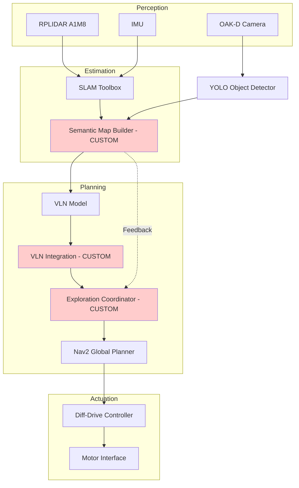

# Report 2: Mid-Point Technical Proof

{: .no_toc }

This page documents our transition from design to implementation, providing concrete evidence of technical progress and system calibration.

---

## Table of Contents

{: .no_toc .text-delta }

1. TOC
{:toc}

---

## 1. Differential Drive Kinematics Model

### State Vector

The robot's state in the world frame is:

```math
q = \begin{bmatrix} x \\\ y \\\ \theta \end{bmatrix}
```

&nbsp;

### Control Inputs

The control inputs are the angular velocities of the right and left wheels: $​\dot{\phi}_R$ and $\dot{\phi}_L$​, where wheel radius is $r$ and track width (wheelbase) is $L$.

&nbsp;

### Forward Kinematics — Mapping from Wheel Velocities to Body/World Velocity

First, wheel angular velocities map to linear wheel speeds:

```math
v_{right} = r\dot{\phi}_R \quad \quad v_{left} = r\dot{\phi}_L
```

&nbsp;

These combine to give the robot's linear and angular velocity:

```math
^xv = \frac{r}{2} (\dot{\phi}_R + \dot{\phi}_L) \quad \quad \omega = \dot{\theta} = \frac{r}{L} (\dot{\phi}_R - \dot{\phi}_L)
```

&nbsp;

### Full World-Frame State Update (the kinematic model)

```math
\dot{q} = v_{world} = \begin{bmatrix} ^xv cos(\theta) \\\ ^xvsin(\theta) \\\ \dot{\theta} \end{bmatrix} = \begin{bmatrix} \frac{r}{2} (\dot{\phi}_R + \dot{\phi}_L) cos(\theta) \\\ \frac{r}{2} (\dot{\phi}_R + \dot{\phi}_L) sin(\theta) \\\ \frac{r}{L} (\dot{\phi}_R - \dot{\phi}_L) \end{bmatrix}
```

&nbsp;

---

## 2. System Architecture

### 2.1 Detailed Computational Map

#### Mermaid Diagram


### 2.2 Module Descriptions

#### Module Declaration Table
| Module / Node | Functional Domain | Software Type | Description |
|---------------|-------------------|---------------|-------------|
| RPLIDAR Driver | Perception | Library | Acquires 360° laser scan data for obstacle detection and SLAM |
| OAK-D Camera Driver | Perception | Library | Provides RGB images and depth maps from a spatial AI camera |
| IMU Driver | Perception | Library | Supplies orientation and acceleration data |
| YOLO Object Detector | Perception | Library | Pre-trained neural network for real-time object detection |
| SLAM Toolbox | Estimation | Library | Performs simultaneous localization and mapping using laser scans |
| **Semantic Map Builder** | **Estimation** | **Custom** | **Fuses object detections with SLAM pose to create annotated map** |
| VLN Model | Planning | Library | Pre-trained vision-language model for navigation decision-making |
| **VLN Integration** | **Planning** | **Custom** | **Bridges VLN model outputs to ROS navigation stack** |
| **Exploration Coordinator** | **Planning** | **Custom** | **Manages exploration loop and task completion criteria** |
| Nav2 Global Planner | Planning | Library | Computes collision-free paths on occupancy grid |
| Diff-Drive Controller | Actuation | Library | Translates velocity commands to wheel motor controls |
---

## 3. Experimental Analysis & Validation

### 3.1 Noise & Uncertainty Analysis

### 3.2 Run-Time Issues

### 3.3 Milestone Video

---

## 4. Project Management

### 4.1 Instructor Feedback Integration

| Critiques/Questions | Specific Technical Actions Taken |
|---------------------|----------------------------------|
| 1. Do you plan to add more objects to the environment? How will you handle objects added or removed by other students in a common space during operation? |  |
| 2. How exactly are you calculating positional error? |  |
| 3. What specifically are "suggested actions" under the VLN integration? |  |
| 4. I’m not quite understanding the need for the YOLO model if the VLN model already takes camera images and instructions as inputs. Could you clarify? |  |
| 5. If the VLN outputs waypoints in the SLAM map, what custom work is required to convert that to a Nav2 goal? I see that as a very short task, is the bulk of the custom work in the semantic map builder? |  |

### 4.2 Individual Contribution

| Team Member | Primary Technical Role | Key Git Commits/PRs | Specific File(s) Authorship (Direct Links) |
|-------------|------------------------|---------------------|--------------------------------------------|
| Ackshaya J |  |  |  |
| Moss Barnett |  |  |  |
| Nivas Piduru |  |  |  |

---
