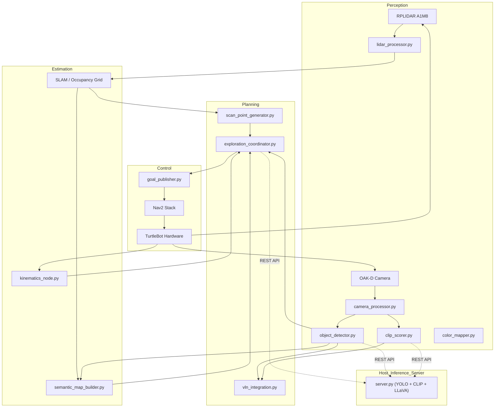
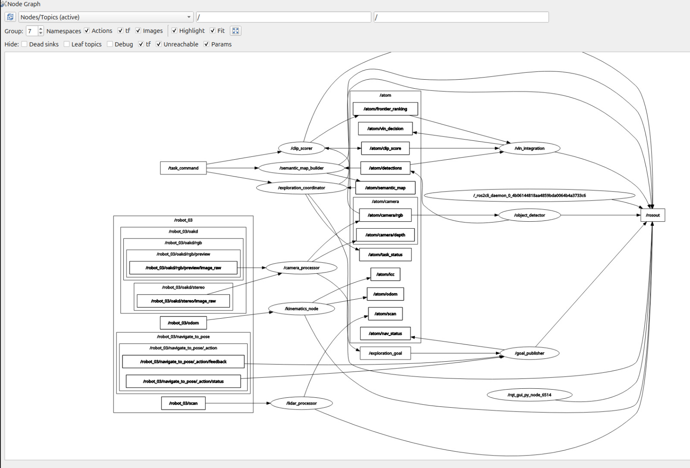

# Report 2: Mid-Point Technical Proof

{: .no_toc }

This page presents the mid-point technical development of the project, detailing the implemented system architecture, the underlying kinematic model, the complete ROS 2 computational pipeline, and an analysis of real-world system behavior, including sensor uncertainty and run-time performance.

---

## Table of Contents

{: .no_toc .text-delta }

1. TOC
{:toc}

---

## 1. Differential Drive Kinematics Model

The differential drive is one of the most common mobile robot configurations. It consists of two independently actuated wheels mounted on the same axis, with a passive caster wheel for balance. By varying the speeds of the left and right wheels, the robot can move forward, backward, and turn. The kinematics model below formally describes how the robot's motion is determined by its wheel velocities.

&nbsp;

### 1.1 State Vector

The robot's configuration in the environment is captured by a state vector that describes its position and orientation in the 2D world frame. The state vector is defined as:

$$
q = \begin{bmatrix} x \\\ y \\\ \theta \end{bmatrix}
$$

Where:
- $$x$$ and $$y$$ represent the robot's position in the world frame.
- $$\theta$$ represents the robot's heading angle (orientation) measured counterclockwise from the world x-axis.

&nbsp;

### 1.2 Control Inputs

The robot is controlled by independently commanding the angular velocities of its two drive wheels. These are the sole inputs that determine the robot's motion, making the differential drive an underactuated system — it can only directly control two degrees of freedom (linear and angular velocity) despite operating in a 3-DOF space $$(x, y, \theta)$$.

The control inputs are the angular velocities of the right and left wheels: $$​\dot{\phi}_R$$ and $$\dot{\phi}_L$$​, where wheel radius is $$r$$ and track width (wheelbase) is $$L$$.

&nbsp;

### 1.3 Forward Kinematics — Mapping from Wheel Velocities to Body/World Velocity

Forward kinematics describes how low-level wheel commands translate into the robot's motion. Each wheel's angular velocity is first converted into a tangential linear speed at the wheel's contact point with the ground:

$$
v_{right} = r\dot{\phi}_R \quad \quad v_{left} = r\dot{\phi}_L
$$

Where $$r$$ is the wheel radius. Since both wheels are rigidly coupled to the same chassis, their individual speeds can be combined to determine the robot's overall linear velocity $$^xv$$ (the average of both wheel speeds) and angular velocity $$\omega$$ (proportional to their difference). When both wheels spin at equal speeds the robot moves in a straight line; when they differ, the robot turns:

$$
^xv = \frac{r}{2} (\dot{\phi}_R + \dot{\phi}_L) \quad \quad \omega = \dot{\theta} = \frac{r}{L} (\dot{\phi}_R - \dot{\phi}_L)
$$

Where $$L$$ is the track width (distance between the two wheels).

&nbsp;

### 1.4 Full World-Frame State Update (the kinematic model)

The robot's body-frame velocities onto the world frame using the heading angle $$\theta$$. This yields the complete kinematic model, a direct mapping from wheel control inputs $$(\dot{\phi}_R, \dot{\phi}_L)$$ to the time derivatives of the robot's state $$(x, y, \theta)$$:

$$
\dot{q} = v_{world} = \begin{bmatrix} ^xv cos(\theta) \\\ ^xvsin(\theta) \\\ \dot{\theta} \end{bmatrix} = \begin{bmatrix} \frac{r}{2} (\dot{\phi}_R + \dot{\phi}_L) cos(\theta) \\\ \frac{r}{2} (\dot{\phi}_R + \dot{\phi}_L) sin(\theta) \\\ \frac{r}{L} (\dot{\phi}_R - \dot{\phi}_L) \end{bmatrix}
$$

This model assumes planar motion on a flat surface, pure rolling contact (no wheel slip), and a rigid chassis, which are all consistent with the standard differential drive assumptions. These equations serve as the foundation for odometry estimation and motion planning in the system's implementation.

&nbsp;

# **2. System Architecture**

## **2.1 Detailed Computational Map**

### **Mermaid Diagram**

```mermaid
  graph TB
    subgraph Perception
        A[RPLIDAR A1M8]
        B[OAK-D Camera]
        CP[camera_processor.py]
        LP[lidar_processor.py]
        OD[object_detector.py]
        CS[clip_scorer.py]
        CM[color_mapper.py]
    end
    
    subgraph Estimation
        D[SLAM / Occupancy Grid]
        E[semantic_map_builder.py]
        K[kinematics_node.py]
    end
    
    subgraph Planning
        F[scan_point_generator.py]
        G[vln_integration.py]
        H[exploration_coordinator.py]
    end
    
    subgraph Control
        I[goal_publisher.py]
        J[Nav2 Stack]
        TB[TurtleBot Hardware]
    end

    subgraph Host_Inference_Server
        S["server.py (YOLO + CLIP + LLaVA)"]
    end

    A --> LP
    B --> CP
    CP --> OD
    CP --> CS

    LP --> D
    D --> F
    D --> E

    OD --> E
    OD --> H
    OD --> G

    CS --> G

    E --> H
    F --> H
    K --> H

    H --> I
    I --> J
    J --> TB

    TB --> K
    TB --> B
    TB --> A

    OD -. REST API .-> S
    CS -. REST API .-> S
    H -. REST API .-> S
```

### RQT graph

## **2.2 System Architecture Overview**

* The system is implemented as a **distributed ROS 2 architecture**, where sensing, perception, decision-making, and control are separated into modular nodes that communicate through typed topics and action interfaces.
* Due to computational limitations inside the virtual machine, all heavy deep learning inference workloads are **offloaded to a host machine**, where a dedicated `server.py` process runs YOLO, CLIP, and LLaVA models.
* The ROS 2 nodes inside the VM communicate with this server using **HTTP REST APIs**, where images are encoded as Base64 and sent as JSON payloads, and inference results are returned as structured JSON responses.
* This architecture ensures that:

  * real-time control and navigation remain stable within the VM,
  * GPU-intensive workloads are executed efficiently on the host machine,
  * and the system maintains modular separation between robotics infrastructure and AI inference.

## **2.3 Module Descriptions**

### **Library Modules**

**SLAM / Occupancy Grid (Estimation – Library)**

* The SLAM system generates a 2D occupancy grid map $(M(x,y) \in {-1, 0, 100})$, where unknown, free, and occupied cells are represented numerically and updated continuously using LiDAR data.
* The occupancy grid serves as the primary spatial representation of the environment and is used by both the Nav2 planner for path planning and the scan point generator for selecting exploration waypoints.
* The map is published with **TRANSIENT_LOCAL durability**, allowing late subscribers such as the exploration coordinator to access previously generated map data without requiring re-initialization.

**Nav2 Stack (Planning & Control – Library)**

* The Nav2 stack is responsible for computing and executing collision-free navigation paths using the occupancy grid produced by SLAM.
* The global planner generates paths using graph-based search (typically A*), while the local planner executes velocity commands that respect dynamic constraints and obstacle avoidance.
* Navigation goals are provided as `NavigateToPose` actions, and feedback is continuously monitored to determine whether the robot has reached, failed, or rejected a goal.

### **Custom Modules**

**Camera Processor (`camera_processor.py`)**

* The camera processor node acts as a **data bridge between the OAK-D camera driver and the perception pipeline**, subscribing to `/oakd/rgb/preview/image_raw` and republishing it as `/atom/camera/rgb`.
* The node preserves message headers and timestamps to maintain synchronization with other sensor streams, ensuring consistency across perception modules.
* In addition to RGB data, the node also republishes stereo depth frames from `/oakd/stereo/image_raw` to `/atom/camera/depth`, although this depth information is currently not consumed by downstream modules and is reserved for future integration.
* The node uses a BEST_EFFORT QoS policy to match the camera driver’s publishing behavior, preventing message drops due to QoS incompatibility.

**LiDAR Processor (`lidar_processor.py`)**

* The LiDAR processor node subscribes to raw `/scan` data and filters invalid range values by enforcing a bounded interval ([r_{min}, r_{max}]), where values outside this range are replaced with infinity.
* Formally, the filtering operation is defined as:
$$
  [
  r' =
  \begin{cases}
  r & r_{min} \le r \le r_{max} \
  \infty & \text{otherwise}
  \end{cases}
  ]
$$
* This ensures that downstream modules such as SLAM and costmap generation are not affected by spurious measurements or sensor noise.
* The filtered scan is republished on `/atom/scan` with RELIABLE QoS to guarantee delivery to critical estimation components.

**Kinematics Node (`kinematics_node.py`)**

* The kinematics node implements the differential-drive motion model using the instantaneous center of curvature (ICC) formulation, transforming velocity inputs into pose updates in the global frame.
* Given linear velocity (v) and angular velocity (\omega), wheel velocities are computed as:
$$
  [
  v_r = v + \frac{\omega L}{2}, \quad v_l = v - \frac{\omega L}{2}
  ]
$$
* The pose is updated using either:

    * circular motion via ICC when \|ω\| > 0, or
    * linear motion when ω ≈ 0.
* The node publishes refined odometry on `/atom/odom` and additionally publishes the ICC position on `/atom/icc` for debugging and validation of curved motion trajectories.

**Scan Point Generator (`scan_point_generator.py`)**

* The scan point generator extracts strategic exploration waypoints from the occupancy grid by identifying large connected regions of free space.
* The algorithm:

  * converts the occupancy grid into a binary free-space mask,
  * applies morphological erosion to avoid boundary regions,
  * performs connected component analysis,
  * and computes centroids of the largest components as candidate scan points.
* These points are then transformed into map-frame coordinates using the grid resolution and origin and are prioritized based on region size.
* This approach ensures that exploration is guided by **spatial coverage** rather than random motion.

**Color Mapper (`color_mapper.py`)**

* The color mapper provides a lightweight perception filter that maps task descriptions to HSV color ranges, enabling pre-filtering of candidate regions in the image.
* For a given image, a binary mask is computed:
$$
  [
  \text{mask}(x,y) = \mathbb{1}[H,S,V \in \text{range}]
  ]
$$
* The proportion of matching pixels is evaluated, and if it exceeds a threshold (typically 1%), the color is considered present.
* The centroid of the detected region is computed using image moments, and its horizontal position is used to classify the direction of the object as left, center, or right.
* This module acts as a **fast heuristic attention mechanism**, reducing reliance on more computationally expensive detection pipelines.

**Object Detector (`object_detector.py`)**

* The object detector performs continuous YOLO-based object detection by sending camera frames to the host server’s `/detect` endpoint and receiving bounding boxes, class labels, and confidence scores.
* Detection outputs are filtered using a configurable confidence threshold before being published as structured JSON messages on `/atom/detections`.
* The node also operates in an **event-triggered mode**, where it responds to `/atom/scan_trigger` messages from the exploration coordinator:

  * in scan mode, it executes color-based filtering,
  * [YET TO BE IMPLEMENTED] in verification mode, it sends the current frame to the `/llava_reason` endpoint for semantic validation. 
* Bounding box size is used to estimate object depth using:
$$
d = 3.0 \cdot \left(1 - \frac{A_{\text{bbox}}}{A_{\text{frame}}}\right)
$$

  which provides an approximate distance estimate for downstream use.
* The node also publishes visualization frames with annotated detections for debugging and monitoring.

**Semantic Map Builder (`semantic_map_builder.py`)**

* The semantic map builder aggregates object detections and projects them into the global map frame using TF2 transformations.
* For each detection, pixel coordinates and estimated depth are converted into camera-frame coordinates and then transformed into the map frame:
$$
  [
  P_{map} = T_{map \leftarrow camera}(P_{camera})
  ]
$$
* Objects are stored in a structured list containing class, position, confidence, and observation count.
* Spatial deduplication is performed by merging detections of the same class within a fixed radius (e.g., 0.5 m).
* The resulting map is published as a JSON string on `/atom/semantic_map`, providing a transient semantic representation of the environment.
* In the current system, this map is **not used as the primary driver of navigation decisions**, but serves as a perception record.

**Exploration Coordinator (`exploration_coordinator.py`)**

* The exploration coordinator implements a state machine governing the robot’s behavior:
$$
\text{IDLE} \rightarrow \text{MOVING-TO-SCAN} \rightarrow \text{SCANNING} \rightarrow \text{APPROACHING} \rightarrow \text{VERIFYING} \rightarrow \text{DONE}
$$

* Exploration is driven by scan points generated from the occupancy grid, ensuring systematic coverage of the environment.
* At each scan point, the robot performs a structured 360° rotation, pausing at fixed angular intervals to trigger perception.
* When a valid color detection is observed, the robot performs incremental approach steps toward the detected direction, with a maximum number of attempts to avoid false positives.
* Upon reaching a candidate object location, the node triggers LLaVA-based verification before declaring task completion.
* The system is **event-driven**, where perception signals can interrupt scanning and trigger state transitions.

**Goal Publisher (`goal_publisher.py`)**

* The goal publisher converts exploration goals into Nav2-compatible `NavigateToPose` action requests.
* Goals are received as JSON messages and translated into map-frame coordinates with appropriate timestamps and orientation.
* The node monitors action responses and publishes navigation status updates, enabling the exploration coordinator to react to goal completion, rejection, or failure.

**CLIP Scorer (`clip_scorer.py`)**

* The CLIP scorer computes similarity between the current camera frame and the task description by querying the `/clip_score` endpoint on the host server.
* The similarity score is computed as:
$$
s = \frac{f_{\text{image}} \cdot f_{\text{text}}}{|f_{\text{image}}| \, |f_{\text{text}}|}
$$

* Scores above a threshold are published as exploration hints, although these signals are currently not integrated into the navigation control loop.

**VLN Integration (`vln_integration.py`)**

* The VLN integration module aggregates perception outputs such as CLIP scores and detection results and publishes structured exploration decisions.
* In the current implementation, these outputs are not directly used to control navigation, but the module provides a framework for future integration of vision-language navigation models.

## 3. Experimental Analysis & Validation

### 3.1 Noise & Uncertainty Analysis

### 3.2 Run-Time Issues

### 3.3 Milestone Video

## 4. Project Management

### 4.1 Instructor Feedback Integration

| Critiques/Questions | Specific Technical Actions Taken |
|---------------------|----------------------------------|
| 1. Do you plan to add more objects to the environment? How will you handle objects added or removed by other students in a common space during operation? |  |
| 2. How exactly are you calculating positional error? |  |
| 3. What specifically are "suggested actions" under the VLN integration? |  |
| 4. I’m not quite understanding the need for the YOLO model if the VLN model already takes camera images and instructions as inputs. Could you clarify? |  |
| 5. If the VLN outputs waypoints in the SLAM map, what custom work is required to convert that to a Nav2 goal? I see that as a very short task, is the bulk of the custom work in the semantic map builder? |  |

### 4.2 Individual Contribution

| Team Member | Primary Technical Role | Key Git Commits/PRs | Specific File(s) Authorship (Direct Links) |
|-------------|------------------------|---------------------|--------------------------------------------|
| Akshaya J |  |  |  |
| Moss Barnett |  |  |
| Nivas Piduru |  |  |