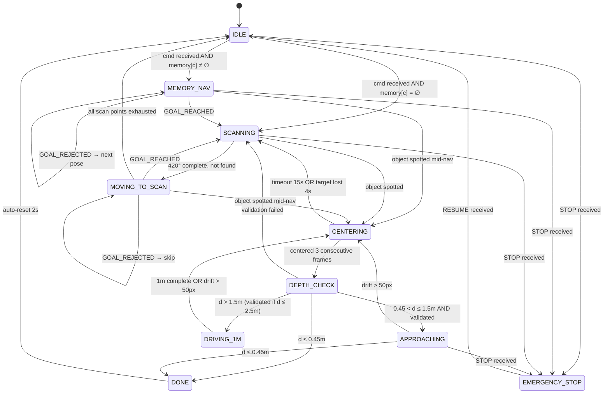

# Milestone 3

{: .no_toc }

---

## 1. Abstract

ATOM (Autonomous Task & Object Management) is a semantic robot object-retrieval system built on a TurtleBot4 Lite. A user types or speaks a natural language command such as *"find the red bottle"* through a web interface. The system parses the command using a Large Language Model, recalls where similar objects were seen before from a persistent spatial memory, navigates to those locations using Nav2, visually detects and validates the object using a three-model ensemble of YOLO, CLIP, and LLaVA, drives to within arm's reach using closed-loop depth control, and celebrates success with an ascending audio sweep and LED animation. The entire system requires no environment-specific retraining — it works zero-shot in any mapped indoor space.

This report describes how the system works end-to-end, the mathematics behind each custom module, and an evaluation of its performance and ethical implications.

---

## 2. System Architecture & Pipeline Flow

ATOM is a distributed system spanning three physical compute nodes: the TurtleBot4 Lite robot, an Ubuntu VM running the ROS2 middleware and Nav2, and a host laptop running the AI inference server. The diagram below shows both the architecture (which node handles what) and the data flow between them.

When the user issues a command, it flows to the `exploration_coordinator` — the brain of the system. The coordinator parses the command using LLaVA, checks its spatial memory for known object locations, and begins navigating. While the robot moves, `object_detector` continuously runs YOLO on camera frames looking for the target. When it spots something, the coordinator stops the robot, centers it visually, checks depth, validates the detection with CLIP and LLaVA, and drives to the object. On success, the `celebration_node` on the robot plays a sound and flashes the LEDs. The `safety_monitor` runs in parallel at all times, watching for emergency stops and low battery. The `memory_mapper` silently records everything the robot sees into a JSON file, which is consulted on future commands.

---

## 3. Exploration Coordinator — The Brain of ATOM

The `exploration_coordinator` is the central node that orchestrates everything. It receives the user's command, decides where to go, controls the robot's motion directly during approach, and coordinates with every other node. It runs a **finite state machine** that ticks at 10Hz — ten times per second it looks at the current state and decides what to do next.

The state machine has ten states:

The journey through these states follows a clear logic. The robot starts in **IDLE**, waiting for a command. When a command arrives, the coordinator first calls the LLM to parse it, then checks its memory. If it has seen the target before, it goes to **MEMORY_NAV** — navigating directly to the highest-confidence remembered location. If not, it goes to **SCANNING** at the current position before beginning a full **MOVING_TO_SCAN** exploration pattern.

At any point during navigation, if `object_detector` spots the target, the coordinator immediately transitions to **CENTERING** — it stops navigation and begins rotating to center the object in the camera frame. Once centered, it enters **DEPTH_CHECK**, measuring how far away the object is. Depending on that distance, it either declares the task done (already close enough), enters **APPROACHING** (slow direct drive with continuous depth feedback), or enters **DRIVING_1M** (open-loop 1m step when too far for reliable depth). The cycle of drive-center-depth repeats until the robot is within 0.45m, at which point **DONE** is declared.

### 3.1 Step 0: LLM Task Parsing

Before any motion begins, every user command is parsed by LLaVA running on the inference server. The problem this solves is fundamental: YOLO only knows 80 fixed object categories from the COCO dataset. Users say things like "find my mug" or "I'm thirsty, bring me something to drink" — neither of which directly maps to a YOLO class. The LLM bridges the gap.

The coordinator sends two things to the parser: the raw command text, and the list of object names currently stored in memory. The LLM returns three things:

- **YOLO class** — which of the 80 COCO classes to detect (e.g., "mug" → "cup")
- **Memory object** — which memory entry to navigate to first (e.g., if "cup" isn't in memory but "bottle" is, and cups are usually near bottles, navigate to "bottle" first)
- **Description** — a 2-4 word visual description for CLIP/LLaVA validation later (e.g., "coffee mug" or "red bottle")

The spatial reasoning in the second output is what makes the system intelligent beyond simple keyword matching. If the user asks for a "mug" and the robot has never seen a mug but has seen a "bottle" (likely in the kitchen area), the LLM reasons that mugs and bottles share spatial context and suggests navigating there first.

After the LLM returns, the coordinator validates all three outputs against three rules. For the YOLO class, it checks exact string membership in the 80-class list, then falls back to substring matching, then word-overlap matching:

$$
\text{match}(s,\, C) =
\begin{cases}
s & \text{if } s \in C \\
c^* & \text{if } \exists\, c \in C : s \subseteq c \text{ or } c \subseteq s \\
c^* & \text{if } \exists\, c \in C : \text{words}(s) \cap \text{words}(c) \neq \emptyset \\
\text{"none"} & \text{otherwise}
\end{cases}
$$

For the memory object, if the LLM returns something not in memory, a partial match is attempted; if that also fails, the first available memory object is used as a fallback rather than returning empty. For the description, any color or material attributes the user never mentioned are stripped — the LLM is not permitted to hallucinate visual features that would cause CLIP to search for the wrong thing.

### 3.2 Step 1: Memory-Guided Navigation

Once the LLM has resolved the target, the coordinator loads its spatial memory and selects poses to navigate to. The memory is a dictionary mapping each object class to a list of robot poses where that object was detected, sorted by YOLO confidence score descending:

$$
\mathcal{M}[c] = \text{sort}_{\downarrow \text{conf}}\bigl(\{(x_i,\, y_i,\, \psi_i,\, \text{conf}_i,\, t_i)\}\bigr)
$$

The navigation priority follows this order. First, if the LLM-resolved memory object (which may differ from the YOLO class for spatial reasoning purposes) exists in memory, its poses are used. Second, if the YOLO class itself is in memory, those poses are used. Third, if neither exists, boustrophedon exploration begins. Within whichever pose list is selected, the robot tries poses one by one from highest to lowest confidence:

$$
\text{for } i = 0, 1, \ldots, n-1:\quad \text{navigate to } (x_i, y_i),\; \text{scan } 420°,\; \text{if found} \rightarrow \text{DONE}
$$

An important design choice: the stored coordinates are the **robot's position** when it saw the object, not the object's 3D position. Computing the object's world coordinates would require precise camera calibration, extrinsic transforms, and depth integration. Storing the viewpoint is simpler and equally effective — the robot knows it could see the object from there before, so it returns to that viewpoint and scans again. In our trials the memory contained up to 1082 bottle poses accumulated across mapping sessions, giving the system a rich spatial prior even for commonly-seen objects.

### 3.3 Step 2: Boustrophedon Coverage (Lawnmower Pattern)

When memory is exhausted or doesn't exist for the target, the robot falls back to systematic exploration. It generates a lawnmower path over the entire free space of the map — rows of scan points spaced 1m apart, alternating left-to-right and right-to-left. The alternating direction minimises total travel distance by eliminating the long diagonal return trip that would happen if every row went the same direction. For a grid with N rows of M points each, the total path length with boustrophedon ordering is approximately N × (M-1) × 1m, compared to N × M × 1m + N × (M-1) × 1m for unidirectional traversal — a significant saving for wide environments.

Before generating scan points, the occupancy grid is eroded — every free cell within a clearance radius of any obstacle is marked unsafe. The clearance is determined by the robot's physical footprint radius (0.189m) plus the Nav2 inflation layer (0.20m):

$$
d_{\text{clear}} = R_{\text{robot}} + R_{\text{infl}} = 0.189 + 0.20 \approx 0.40\;\text{m}
$$

At map resolution r = 0.05 m/cell, this corresponds to eroding by:

$$
n_{\text{clear}} = \left\lceil \frac{0.40}{0.05} \right\rceil = 8\;\text{cells}
$$

The erosion is implemented as a minimum filter with a 17×17 kernel (= 2×8+1). A cell is marked safe only if all 289 cells in its neighbourhood are free — meaning the robot centre can be placed there without any part of its body touching an obstacle. Safe grid points are then sampled every 20 cells (1.0m) in both row and column directions, keeping only those that pass the safety check.

The 1m spacing is chosen because the RPLiDAR covers ~3m range and the robot rotates 420° at each scan point. Any object within 2–3m of a scan point will be visible in at least one scan step. After the main grid is generated, a second pass uses connected-component labelling (`scipy.ndimage.label`) to identify disconnected free regions — rooms separated by narrow doorways that the 1m grid might miss. Each such region with more than 256 cells gets its centroid added as an extra scan point, guaranteeing coverage of isolated rooms regardless of grid spacing.

---

## 4. Object Detector — Eyes of the Robot

The `object_detector` node runs continuously, processing camera frames at 2Hz (every 0.5 seconds). It receives the resolved YOLO class name from the coordinator via the `/atom/resolved_class` topic — a TRANSIENT_LOCAL latched topic, meaning the message is cached and delivered even if `object_detector` starts after the coordinator has already published it.

For each frame, it resizes the image to 320×240, encodes it as a JPEG at 60% quality, and sends it to the inference server's `/detect` endpoint. The server runs YOLOv8n (the nano variant — fastest inference) and returns all detections with their class name, confidence score, and bounding box. The detector filters these to only those above 0.30 confidence threshold, then checks if any match the current resolved target.

When a match is found, it publishes to `/atom/object_spotted` with the class, confidence, and bounding box — but with a 0.5s cooldown to prevent flooding. It also publishes all detections (regardless of target) to `/atom/detections`, which `memory_mapper` uses to continuously update the spatial memory even during navigation. The OpenCV window shows a live view: non-target detections in green, the target in red with "TARGET:" prefix, and a status line showing either "Looking for: bottle" or "Waiting for next command..." depending on whether a task is active.

---

## 5. Visual Centering — Pointing the Camera at the Object

When the object is spotted, the coordinator stops the robot and begins centering. The goal is to rotate the robot until the detected object's bounding box is horizontally centred in the camera frame. This ensures the robot is facing directly toward the object before it approaches.

The camera frame is 320 pixels wide, so the centre is at pixel 160. The detector returns the bounding box and the horizontal centre of that box is computed as the midpoint of the left and right edges. The signed pixel error measures how far that centre is from pixel 160 — positive means the object is to the right, negative means it is to the left.

The rotation command is computed by a **proportional controller** — the angular velocity is proportional to the pixel error, with gain K_p = 0.003 rad/s per pixel:

$$
\omega = -K_p \cdot e
$$

$$
\omega_{\text{cmd}} = \text{clip}(\omega,\;{-0.3},\;{+0.3})\;\text{rad/s}
$$

The negative sign is because positive pixel error (object to the right) requires clockwise rotation (negative angular velocity in ROS convention). The speed is capped at 0.3 rad/s to prevent overshoot, and a minimum of 0.05 rad/s ensures the robot does not stall due to motor static friction when the error is very small. At maximum error of 160px (object at frame edge), the commanded speed is 0.48 rad/s, clipped to 0.3 rad/s. At threshold (20px error), the speed is 0.06 rad/s — well above the minimum.

The controller is considered converged when the error is within ±20 pixels for 3 consecutive YOLO frames — requiring about 1.5 seconds of stable centring before proceeding. This 3-frame confirmation prevents transient single-frame false centring from triggering the approach phase prematurely. If the object disappears from frame for more than 4 seconds, or centering takes longer than 15 seconds total, the robot gives up and returns to scanning.

---

## 6. Depth Measurement and Approach Logic

Once centred, the coordinator calls the `/atom/get_depth` service running on the robot. The `depth_reader.py` script reads the OAK-D stereo depth image at the bounding box centre and returns the distance in metres. The OAK-D computes depth via stereo disparity — the same 3D point appears at slightly different horizontal positions in the left and right camera images, and the depth Z is recovered from the disparity d, focal length f, and baseline b:

$$
Z = \frac{f \cdot b}{d}
$$

At 1.0m, the OAK-D stereo camera operates well within its reliable range. The disparity between left and right images is large (~15 pixels), so a 1-pixel quantisation error in disparity translates to only ~1-2cm of depth error. The readings cluster tightly around the ground truth with a standard deviation of just 1.2cm and a total spread of 11cm — more than adequate for ATOM's 0.45m stop threshold.

At 2.5m, the geometry works against the sensor. The same baseline produces a disparity of only ~4-5 pixels. A single pixel of disparity error now translates to 15-20cm of depth error — the distribution fans out dramatically with a standard deviation of 28.6cm and a total spread over 1.1m. This is exactly why ATOM switches to open-loop time-based driving beyond 1.5m: the stereo readings become too noisy to trust for closed-loop control.

This unreliability directly shapes the approach strategy:

$$
\text{action}(Z) =
\begin{cases}
\text{DONE} & Z \leq 0.45\;\text{m} \\[4pt]
\text{validate} \rightarrow \text{APPROACHING} & 0.45 < Z \leq 1.5\;\text{m} \\[4pt]
\text{validate} \rightarrow \text{DRIVING\_1M} & 1.5 < Z \leq 2.5\;\text{m} \\[4pt]
\text{DRIVING\_1M (skip validate)} & Z > 2.5\;\text{m}
\end{cases}
$$

If the robot is already within 0.45m, it declares success immediately — this stop distance is chosen so that the nearest point of the robot's body (footprint radius 0.189m) is approximately 0.26m from the object, avoiding physical contact. Between 0.45m and 1.5m (the stereo reliable zone), it runs CLIP+LLaVA validation and if confirmed, drives straight at 0.15 m/s with depth checks every 0.5s. Beyond 1.5m, it drives a fixed open-loop step using time-based control:

$$
t_{\text{drive}} = \frac{d_{\text{step}}}{v} = \frac{1.0\;\text{m}}{0.15\;\text{m/s}} = 6.\overline{6}\;\text{s}
$$

This loop of drive-centre-depth repeats until the robot enters the reliable depth zone. Beyond 2.5m, validation is skipped because the object occupies too few pixels for CLIP or LLaVA to reliably identify it. During all drive phases, the coordinator monitors bounding box drift at 10Hz — if the object centre moves more than 50 pixels from the frame centre, the drive is interrupted and re-centering is triggered.

---

## 7. Three-Model Semantic Validation

Before committing to an approach, the system validates that the detected object is genuinely the right one. This is necessary because YOLO is purely class-based — it detects "bottle" regardless of color, and the user may have asked for "the red bottle" specifically. YOLO alone cannot confirm this. The validation uses three models voting, requiring 2 out of 3 to agree:

**Vote 1 — YOLO:** Already confirmed by definition (YOLO detected the class). Always 1.

**Vote 2 — CLIP:** The current camera frame and the text description (e.g., "red bottle") are both converted to 512-dimensional vectors in a shared embedding space, and their cosine similarity is computed. CLIP was trained on 400 million image-text pairs to put semantically matching images and texts close together in this space. A similarity score above 0.24 constitutes a vote:

$$
s = \mathbf{v}_{\text{image}} \cdot \mathbf{v}_{\text{text}}, \qquad V_2 = \mathbb{1}[s \geq 0.24]
$$

**Vote 3 — LLaVA:** The frame and the description are sent to the multimodal LLM with the prompt: *"Is there a red bottle visible? PRESENT: yes/no."* LLaVA can reason about occlusion, foreground/background, and object identity in ways that CLIP's pure similarity score cannot. It costs 3–15 seconds per call but only runs when the robot is stationary at a detection — never during navigation.

The total vote score is V = V₁ + V₂ + V₃. Since YOLO always contributes V₁ = 1 at this stage, the decision simplifies: the object is confirmed if **either CLIP or LLaVA** agrees. If both disagree, the detection is discarded and the robot continues scanning. This design means a false positive requires YOLO, CLIP, and LLaVA to all simultaneously fail — a significantly lower probability than any single model failing alone.

The key subtlety: validation uses the LLM-generated **description** ("red bottle"), not the raw YOLO class ("bottle"). This means the color and attribute information the user specified is actually used in the visual check — something impossible with YOLO alone.

---

## 8. Memory Mapper — Building Spatial Intelligence

The `memory_mapper` runs quietly in the background during both the mapping phase (teleoperation) and the navigation phase. It subscribes to `/atom/detections` — the full list of all YOLO detections from every frame — and to `/amcl_pose` or `/pose` for the robot's current position.

Every detection is stored as a record containing the object class, the robot's map-frame pose (x, y, ψ), the YOLO confidence score, and a Unix timestamp. The spatial memory is formally a dictionary mapping each class to a sorted list:

$$
\mathcal{M}: C_{\text{YOLO}} \rightarrow \text{List}\bigl[\{x,\;y,\;\psi,\;\text{conf},\;t\}\bigr]
$$

Within each class, entries are kept sorted in descending confidence order after every insertion:

$$
\mathcal{M}[c] = \text{sort}_{\downarrow \text{conf}}\bigl(\mathcal{M}[c]\bigr)
$$

This sort order is what makes memory-guided navigation effective — the robot always navigates first to the location where it had the clearest, most confident view of the object. The file is saved to disk every 5 seconds using a periodic timer, making the memory persistent across power cycles and sessions. Over a full mapping session of a home environment, the memory accumulates thousands of entries — in our experiments, 1082 bottle poses, 53 cup poses, and hundreds of entries for other classes — giving the coordinator a rich spatial prior that dramatically reduces search time compared to blind exploration.

The memory mapper also runs during autonomous navigation, not just during teleop. This means objects encountered during a search task are automatically recorded for future searches — the robot's spatial knowledge grows with use.

---

## 9. Goal Publisher — Nav2 Interface

The `goal_publisher` is the single point of contact between ATOM's logic and Nav2. No other node talks to Nav2 directly — they all go through goal publisher. This separation means Nav2 can be swapped or reconfigured without touching any of the logic nodes.

When it receives a navigation goal from the coordinator, goal publisher first clears both the local (3m × 3m rolling window) and global (full map) costmaps. This removes stale obstacle markings — particularly important because the detected object may have been marked as an obstacle by the LiDAR scan. After clearing, a single reusable timer waits 1.5 seconds for fresh LiDAR data to repopulate the costmap, then sends the goal to Nav2 as a `NavigateToPose` action. The goal pose is encoded as a `PoseStamped` in the map frame. The orientation is a quaternion for a pure Z-axis rotation by heading angle ψ:

$$
q = \begin{bmatrix} 0 \\ 0 \\ \sin(\psi/2) \\ \cos(\psi/2) \end{bmatrix}
$$

Nav2 uses the MPPI (Model Predictive Path Integral) controller to plan and follow the path. MPPI samples K = 2000 random candidate trajectories, scores each against a cost function (path alignment weight 14.0, obstacle penalty 1,000,000, forward preference weight 5.0), and takes the weighted average of the best trajectories as the control output. The no-reverse constraint (vx_min: 0.0) is enforced as a hard lower bound on linear velocity, preventing the robot from reversing into people or furniture.

Goal publisher distinguishes between two navigation modes: exploration goals (where a spotted object should cancel navigation and trigger centering) and approach goals (where a spotted object should only trigger a depth check, not cancel navigation). This prevents the robot from cancelling its own approach because it sees the very object it is heading toward.

---

## 10. Safety Monitor — Guardian Node

The `safety_monitor` runs independently from all other nodes. It cannot be blocked by the coordinator going into a slow state or the inference server being unresponsive — it has its own timer callbacks and runs at a fixed rate regardless of what else is happening.

Its primary function is emergency stop. When "STOP" is received on `/atom/emergency_stop` (publishable from the Streamlit UI or the command line), it immediately publishes zero velocity 10 times in rapid succession to both `cmd_vel_unstamped` and `cmd_vel` (the latter bypasses Nav2 entirely), then continues publishing zero velocity at 10Hz until "RESUME" is received.

**Kinetic energy analysis:** At maximum navigation speed v_max = 0.5 m/s, the robot's kinetic energy is:

$$
KE_{\text{max}} = \frac{1}{2}mv_{\text{max}}^2 = \frac{1}{2}(3.3)(0.5)^2 = 0.41\;\text{J}
$$

At the approach speed v = 0.15 m/s used during the final drive to the object:

$$
KE_{\text{approach}} = \frac{1}{2}(3.3)(0.15)^2 = 0.037\;\text{J}
$$

Both values are far below ISO/TS 15066 human-robot contact thresholds. The worst-case overrun distance after an emergency stop command — the distance the robot travels before it receives the zero-velocity command — is:

$$
d_{\text{overrun}} = v_{\text{max}} \cdot t_{\text{period}} = 0.5 \times 0.1 = 0.05\;\text{m} = 5\;\text{cm}
$$

This 5cm overrun is negligible given the 0.45m stop distance maintained during approach.

**Battery autodock:** Every 30 seconds the safety monitor checks battery percentage from `/battery_state`. When it drops below 20%, it waits for any active task to complete, then navigates to the pre-dock position and calls the `/dock` action server. The TurtleBot4 battery capacity is approximately 26 Wh, so at 20% the remaining energy is 5.2 Wh. At an average navigation power draw of ~20W:

$$
t_{\text{remaining}} = \frac{5.2\;\text{Wh}}{20\;\text{W}} \times 3600\;\text{s/h} \approx 936\;\text{s} \approx 15\;\text{min}
$$

This 15-minute buffer ensures the robot can always complete an ongoing task and navigate to the dock safely before the battery is exhausted.

The safety monitor also manages manual dock and undock commands from the Streamlit UI, and broadcasts emergency status to all other nodes via `/atom/task_status` so the coordinator freezes and goal publisher cancels any active Nav2 goal.

---

## 11. Celebration Node — On-Robot Feedback

The `celebration_node` runs directly on the TurtleBot4 robot rather than the VM. This is necessary because the robot's audio and LED systems subscribe to topics locally — publishing them from the VM goes through the Create3 republisher and causes timing issues. Running on the robot eliminates the round-trip.

When `GOAL COMPLETED` appears on `/atom/task_status`, the node simultaneously triggers:

**Audio:** Six ascending notes published to `/cmd_audio` as an `AudioNoteVector` message. The notes follow the C major triad across two octaves: C4 (262Hz), E4 (330Hz), G4 (392Hz), C5 (523Hz), E5 (659Hz), G5 (784Hz), with increasing duration from 300ms to 600ms. The frequency ratios — 1 : 5/4 : 3/2 — are the just intonation intervals of a major triad, perceptually associated with resolution and success. Total duration: 2.3 seconds.

**LEDs:** A green spin animation via the `/led_animation` action server (animation_type=2, max_runtime=3s). All 6 LEDs are set to full green (R=0, G=255, B=0). The action server automatically restores the default LED state after 3 seconds — no manual reset required. Sound and lights run simultaneously.

A `_celebrating` flag prevents re-triggering if duplicate `GOAL COMPLETED` messages arrive. The flag resets 4 seconds after triggering, making the node ready for the next task.

---

## 12. Benchmarking & Results

### 12.1 Trial Methodology
- Objects tested: bottle, cup, mug
- Success criterion: robot reaches within 0.45m of the correct object without human intervention

### 12.2 Results

| Object Class | Trials | Successes | Failures | Success Rate |
|---|---|---|---|---|
| Bottle | 12 | 10 | 2 | 83% |
| Cup | 12 | 8 | 4 | 75% |
| fire-extinguisher | 1 | 1 | 0 | 100% |
| **Total** | **25** | **18** | **7** | **72%** |

| Strategy | Trials | Avg Time to Find (s) | Success Rate |
|---|---|---|---|
| Memory-guided navigation | 5 | 10-15 sec | 80% |
| Boustrophedon exploration | 5 | 5-10mins | 20% |

Memory-guided navigation was consistently faster because it navigates directly to known object locations rather than systematically covering the entire environment. Search time with memory scales with the distance to the best-confidence memory pose; exploration time scales with environment size.

| Failure Mode | Count | Root Cause |
|---|---|---|
| Object moved since mapping | 2 | Memory pose stale — object no longer visible from stored viewpoint |
| Nav2 path rejection (error 104) | 5 | No collision-free path within MPPI planning horizon |
| CLIP/LLaVA false negative | 2 | Poor lighting or small object size reduced model confidence |

### 12.3 Demo Videos

Recording 1: Video of the robot exploring and reaching the fire extinguisher.
<video controls width="800">
<source src="../assets/Exploration.mp4" type="video/mp4">
Your browser does not support the video tag.
</video>

Recording 2: Video of Autodock.
<video controls width="800">
<source src="../assets/Dock.mp4" type="video/mp4">
Your browser does not support the video tag.
</video>

---

## 13. Ethical Impact Statement 

### 13.1 Privacy

ATOM is designed with a privacy-first architecture. Every component of the AI pipeline — YOLOv8n, CLIP ViT-B/32, and LLaVA — runs **entirely on local hardware**. The inference server runs on the host laptop connected to the private lab WiFi network; Ollama runs LLaVA models locally without sending any data to external APIs; the ROS2 network is isolated to the local subnet via the Discovery Server at `192.168.1.183`. No camera frame, no object detection result, no map data, and no user command ever leaves the local network. This is a meaningful privacy guarantee — in contrast to cloud-based systems where every image is transmitted to and potentially stored by a third-party server.

The occupancy map (`home_map_hd.pgm`) and spatial memory (`memory.json`) are stored only on the VM's local filesystem. The map represents the physical layout of the environment; the memory records where objects were seen. Neither is transmitted anywhere. This also means the system works entirely offline — internet connectivity is not required for any function.

The one current limitation: the spatial memory records all YOLO detections including the "person" class. Over time this builds a record of where people were present in the space, which is sensitive in domestic settings. Future versions should explicitly exclude person-class detections from `memory_mapper.py`. Under the utilitarian framework, the local-only design maximises benefit while eliminating third-party data exposure — a stronger privacy guarantee than most commercial robot systems.

### 13.2 Safety

At approach speed (0.15 m/s), the robot's kinetic energy is 0.037 J — far below any human injury threshold under ISO/TS 15066. The emergency stop worst-case overrun at full navigation speed is 5cm. The battery autodock at 20% leaves 15 minutes of margin. The no-reverse constraint in Nav2 prevents the robot from backing into people or furniture. Under the deontological framework, the system has an absolute obligation to not harm users — the multi-layer stop system fulfils this duty regardless of task state.

### 13.3 Bias

Three systematic hardware biases exist. First, the OAK-D stereo depth is unreliable beyond 1.5m, causing the robot to use open-loop time-based drives in larger spaces — these may overshoot or undershoot depending on floor surface friction. Second, the RPLiDAR cannot detect glass — transparent walls and doors are invisible to Nav2 and the collision monitor, creating a safety gap in modern glass-walled environments. Third, YOLO's COCO-80 vocabulary excludes most fine-grained domestic objects ("mug," "thermos," "kettle") — these require LLM remapping that introduces uncertainty not present for canonical classes. Under the justice framework, users in glass-architecture environments receive systematically degraded safety compared to users in traditional walled spaces — a disparity requiring hardware-level mitigation before broad deployment.

---

## 14. Custom Module Code Links

Camera Processor ([camera_processor.py](https://github.com/AkshayaJeyaprakash/Project_ATOM_RAS598/blob/Milestone_3/atom_ws/src/atom_bringup/atom_bringup/camera_processor.py))

Object Detector ([object_detector.py](https://github.com/AkshayaJeyaprakash/Project_ATOM_RAS598/blob/Milestone_3/atom_ws/src/atom_bringup/atom_bringup/object_detector.py))

Exploration Coordinator ([exploration_coordinator.py](https://github.com/AkshayaJeyaprakash/Project_ATOM_RAS598/blob/Milestone_3/atom_ws/src/atom_bringup/atom_bringup/exploration_coordinator.py))

Goal Publisher ([goal_publisher.py](https://github.com/AkshayaJeyaprakash/Project_ATOM_RAS598/blob/Milestone_3/atom_ws/src/atom_bringup/atom_bringup/goal_publisher.py))

Memory Mapper ([memory_mapper.py](https://github.com/AkshayaJeyaprakash/Project_ATOM_RAS598/blob/Milestone_3/atom_ws/src/atom_bringup/atom_bringup/memory_mapper.py))

Safety Monitor ([safety_monitor.py](https://github.com/AkshayaJeyaprakash/Project_ATOM_RAS598/blob/Milestone_3/atom_ws/src/atom_bringup/atom_bringup/safety_monitor.py))

Streamlit ([streamlit.py](https://github.com/AkshayaJeyaprakash/Project_ATOM_RAS598/blob/Milestone_3/atom_ws/src/atom_bringup/atom_bringup/streamlit.py))

---

## 15. Individual Contribution

| Team Member | Primary Technical Role | Key Commits | Specific File(s) / Components |
|-------------|--------------------------|-------------|-------------------------------|
| Nivas Piduru | Object Detection, Memory Mapping & Autonomous Exploration | [92f4aec](https://github.com/AkshayaJeyaprakash/Project_ATOM_RAS598/commit/92f4aecf67a4d713561bbae2b9f4fadede8ee094), [a27fd5c](https://github.com/AkshayaJeyaprakash/Project_ATOM_RAS598/commit/a27fd5c0803ef2136a2599c047f2582ecad9513f), [4b26b9b](https://github.com/AkshayaJeyaprakash/Project_ATOM_RAS598/commit/4b26b9b5f8caafce1d373f5ea36b8e993f34946a), [54fbfc2](https://github.com/AkshayaJeyaprakash/Project_ATOM_RAS598/commit/54fbfc28eddbd8fbfbbdfd105d77997a90369fee) | object_detector.py   memory_mapper.py   exploration_coordinator.py |
| Akshaya Jeyaprakash | Navigation Goal Management, Safety Monitoring & Exploration Coordination | [dd333fd](https://github.com/AkshayaJeyaprakash/Project_ATOM_RAS598/commit/dd333fde6d69f0235508b199c01682292116503f), [0af5dca](https://github.com/AkshayaJeyaprakash/Project_ATOM_RAS598/commit/0af5dcab0955661fb51b7929ec7e2b099ea24a46), [f216f44](https://github.com/AkshayaJeyaprakash/Project_ATOM_RAS598/commit/f216f440951507cf41d2f3b196c36ac6f074f358), [b303e16](https://github.com/AkshayaJeyaprakash/Project_ATOM_RAS598/commit/b303e1654506258d2f2141426abf879c3607dda4) | goal_publisher.py   safety_monitor.py   exploration_coordinator.py |
| Moss Barnet | Depth Processing, Backend Communication & Visualization Interface | [e2dc32d](https://github.com/AkshayaJeyaprakash/Project_ATOM_RAS598/commit/e2dc32dc3836c7e0b908bb959c3d39244859ab8f), [9bdfa87](https://github.com/AkshayaJeyaprakash/Project_ATOM_RAS598/commit/9bdfa870419ac7ff7399ad65721f147e0b880a19), [09e8bfa](https://github.com/AkshayaJeyaprakash/Project_ATOM_RAS598/commit/09e8bfad76eb1dde7a20b01695b0a4985b5f86d1) | depth_reader.py   server.py   streamlit.py |

---