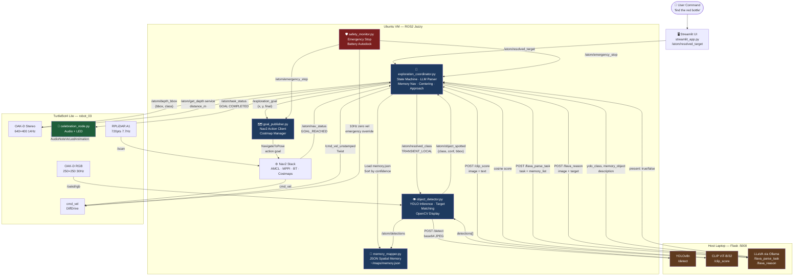
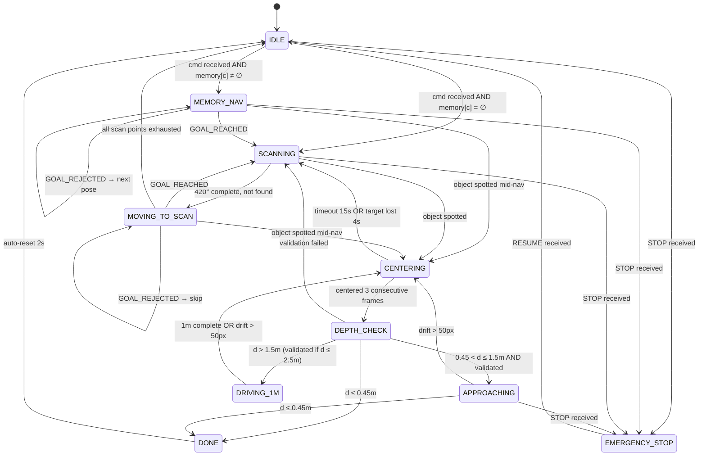

# Milestone 3

{: .no_toc }

---

## 1. Abstract

ATOM (Autonomous Task & Object Management) is a semantic robot object-retrieval system built on a TurtleBot4 Lite. A user types or speaks a natural language command such as *"find the red bottle"* through a web interface. The system parses the command using a Large Language Model, recalls where similar objects were seen before from a persistent spatial memory, navigates to those locations using Nav2, visually detects and validates the object using a three-model ensemble of YOLO, CLIP, and LLaVA, drives to within arm's reach using closed-loop depth control, and celebrates success with an ascending audio sweep and LED animation. The entire system requires no environment-specific retraining — it works zero-shot in any mapped indoor space.

This report describes how the system works end-to-end, the mathematics behind each custom module, and an evaluation of its performance and ethical implications.

---

## 2. System Architecture & Pipeline Flow

ATOM is a distributed system spanning three physical compute nodes: the TurtleBot4 Lite robot, an Ubuntu VM running the ROS2 middleware and Nav2, and a host laptop running the AI inference server. The diagram below shows both the architecture (which node handles what) and the data flow between them.

When the user issues a command, it flows to the `exploration_coordinator` — the brain of the system. The coordinator parses the command using LLaVA, checks its spatial memory for known object locations, and begins navigating. While the robot moves, `object_detector` continuously runs YOLO on camera frames looking for the target. When it spots something, the coordinator stops the robot, centers it visually, checks depth, validates the detection with CLIP and LLaVA, and drives to the object. On success, the `celebration_node` on the robot plays a sound and flashes the LEDs. The `safety_monitor` runs in parallel at all times, watching for emergency stops and low battery. The `memory_mapper` silently records everything the robot sees into a JSON file, which is consulted on future commands.

---

## 3. Exploration Coordinator — The Brain of ATOM

The `exploration_coordinator` is the central node that orchestrates everything. It receives the user's command, decides where to go, controls the robot's motion directly during approach, and coordinates with every other node. It runs a **finite state machine** that ticks at 10Hz — ten times per second it looks at the current state and decides what to do next.

The state machine has ten states:

The journey through these states follows a clear logic. The robot starts in **IDLE**, waiting for a command. When a command arrives, the coordinator first calls the LLM to parse it, then checks its memory. If it has seen the target before, it goes to **MEMORY_NAV** — navigating directly to the highest-confidence remembered location. If not, it goes to **SCANNING** at the current position before beginning a full **MOVING_TO_SCAN** exploration pattern.

At any point during navigation, if `object_detector` spots the target, the coordinator immediately transitions to **CENTERING** — it stops navigation and begins rotating to center the object in the camera frame. Once centered, it enters **DEPTH_CHECK**, measuring how far away the object is. Depending on that distance, it either declares the task done (already close enough), enters **APPROACHING** (slow direct drive with continuous depth feedback), or enters **DRIVING_1M** (open-loop 1m step when too far for reliable depth). The cycle of drive-center-depth repeats until the robot is within 0.45m, at which point **DONE** is declared.

### 3.1 Step 0: LLM Task Parsing

Before any motion begins, every user command is parsed by LLaVA running on the inference server. The problem this solves is fundamental: YOLO only knows 80 fixed object categories from the COCO dataset. Users say things like "find my mug" or "I'm thirsty, bring me something to drink" — neither of which directly maps to a YOLO class. The LLM bridges the gap.

The coordinator sends two things to the parser: the raw command text, and the list of object names currently stored in memory. The LLM returns three things:

- **YOLO class** — which of the 80 COCO classes to detect (e.g., "mug" → "cup")
- **Memory object** — which memory entry to navigate to first (e.g., if "cup" isn't in memory but "bottle" is, and cups are usually near bottles, navigate to "bottle" first)
- **Description** — a 2-4 word visual description for CLIP/LLaVA validation later (e.g., "coffee mug" or "red bottle")

The spatial reasoning in the second output is what makes the system intelligent beyond simple keyword matching. If the user asks for a "mug" and the robot has never seen a mug but has seen a "bottle" (likely in the kitchen area), the LLM reasons that mugs and bottles share spatial context and suggests navigating there first.

After the LLM returns, the coordinator validates all three outputs against three rules. For the YOLO class, it checks exact string membership in the 80-class list, then falls back to substring matching, then word-overlap matching:

$$
\text{match}(s,\, C) =
\begin{cases}
s & \text{if } s \in C \\
c^* & \text{if } \exists\, c \in C : s \subseteq c \text{ or } c \subseteq s \\
c^* & \text{if } \exists\, c \in C : \text{words}(s) \cap \text{words}(c) \neq \emptyset \\
\text{"none"} & \text{otherwise}
\end{cases}
$$

For the memory object, if the LLM returns something not in memory, a partial match is attempted; if that also fails, the first available memory object is used as a fallback rather than returning empty. For the description, any color or material attributes the user never mentioned are stripped — the LLM is not permitted to hallucinate visual features that would cause CLIP to search for the wrong thing.

### 3.2 Step 1: Memory-Guided Navigation

Once the LLM has resolved the target, the coordinator loads its spatial memory and selects poses to navigate to. The memory is a dictionary mapping each object class to a list of robot poses where that object was detected, sorted by YOLO confidence score descending:

$$
\mathcal{M}[c] = \text{sort}_{\downarrow \text{conf}}\bigl(\{(x_i,\, y_i,\, \psi_i,\, \text{conf}_i,\, t_i)\}\bigr)
$$

The navigation priority follows this order. First, if the LLM-resolved memory object (which may differ from the YOLO class for spatial reasoning purposes) exists in memory, its poses are used. Second, if the YOLO class itself is in memory, those poses are used. Third, if neither exists, boustrophedon exploration begins. Within whichever pose list is selected, the robot tries poses one by one from highest to lowest confidence:

$$
\text{for } i = 0, 1, \ldots, n-1:\quad \text{navigate to } (x_i, y_i),\; \text{scan } 420°,\; \text{if found} \rightarrow \text{DONE}
$$

An important design choice: the stored coordinates are the **robot's position** when it saw the object, not the object's 3D position. Computing the object's world coordinates would require precise camera calibration, extrinsic transforms, and depth integration. Storing the viewpoint is simpler and equally effective — the robot knows it could see the object from there before, so it returns to that viewpoint and scans again. In our trials the memory contained up to 1082 bottle poses accumulated across mapping sessions, giving the system a rich spatial prior even for commonly-seen objects.

### 3.3 Step 2: Boustrophedon Coverage (Lawnmower Pattern)

When memory is exhausted or doesn't exist for the target, the robot falls back to systematic exploration. It generates a lawnmower path over the entire free space of the map — rows of scan points spaced 1m apart, alternating left-to-right and right-to-left. The alternating direction minimises total travel distance by eliminating the long diagonal return trip that would happen if every row went the same direction. For a grid with N rows of M points each, the total path length with boustrophedon ordering is approximately N × (M-1) × 1m, compared to N × M × 1m + N × (M-1) × 1m for unidirectional traversal — a significant saving for wide environments.

Before generating scan points, the occupancy grid is eroded — every free cell within a clearance radius of any obstacle is marked unsafe. The clearance is determined by the robot's physical footprint radius (0.189m) plus the Nav2 inflation layer (0.20m):

$$
d_{\text{clear}} = R_{\text{robot}} + R_{\text{infl}} = 0.189 + 0.20 \approx 0.40\;\text{m}
$$

At map resolution r = 0.05 m/cell, this corresponds to eroding by:

$$
n_{\text{clear}} = \left\lceil \frac{0.40}{0.05} \right\rceil = 8\;\text{cells}
$$

The erosion is implemented as a minimum filter with a 17×17 kernel (= 2×8+1). A cell is marked safe only if all 289 cells in its neighbourhood are free — meaning the robot centre can be placed there without any part of its body touching an obstacle. Safe grid points are then sampled every 20 cells (1.0m) in both row and column directions, keeping only those that pass the safety check.

The 1m spacing is chosen because the RPLiDAR covers ~3m range and the robot rotates 420° at each scan point. Any object within 2–3m of a scan point will be visible in at least one scan step. After the main grid is generated, a second pass uses connected-component labelling (`scipy.ndimage.label`) to identify disconnected free regions — rooms separated by narrow doorways that the 1m grid might miss. Each such region with more than 256 cells gets its centroid added as an extra scan point, guaranteeing coverage of isolated rooms regardless of grid spacing.

---

## 4. Ethical Impact Statement

Our autonomous TurtleBot 4 system integrates natural language understanding, computer vision-based object detection, and semantic mapping to explore environments and identify user-specified objects. This combination introduces important ethical considerations in privacy, safety, and bias that must be addressed both in current implementation and future iterations.

From a privacy standpoint, the robot uses onboard RGB and depth sensing for object detection and mapping. These sensors may capture incidental visual data such as people, personal belongings, or sensitive environments during exploration. Although our current system does not explicitly store or transmit personally identifiable information, future versions that log semantic maps or annotated images could unintentionally retain sensitive data. To mitigate this, we should implement data minimization strategies, such as discarding raw images after inference, applying real-time anonymization techniques like face or text blurring, and restricting long-term storage of environment data.

In terms of safety, the robot operates using a differential drive model and autonomous exploration strategies in potentially dynamic environments. Motion is governed by wheel velocities, meaning unsafe velocity commands or perception failures could result in collisions. This is especially relevant when combining exploration with object-seeking behavior, which may bias the robot toward goal completion over obstacle avoidance. Safety can be improved through strict velocity limits, reliable obstacle detection using depth sensing, and fail-safe mechanisms such as emergency stops. Future iterations should include redundancy across sensing modalities and more robust runtime validation of navigation decisions.

Bias in the system primarily stems from hardware and perception limitations. Vision-based object detection models such as YOLO may exhibit uneven performance depending on lighting, object appearance, or dataset bias. Additionally, depth sensors and LiDAR struggle with reflective or transparent surfaces such as glass, leading to incomplete environmental understanding. These limitations can cause the robot to perform inconsistently across environments, creating unequal reliability. Sensor fusion, combining vision, depth, and potentially LiDAR, can help reduce these biases.

Applying the Utilitarian Test, the system provides clear benefits by enabling intuitive human-robot interaction and autonomous exploration, but these benefits must be balanced against risks such as privacy exposure and physical harm. The Justice Test highlights the need for consistent performance across environments, ensuring that failures do not disproportionately affect certain users or settings. The Virtue Test emphasizes responsible engineering practices, requiring us to prioritize safety, transparency, and continuous system improvement.

Overall, ethical deployment of this system requires anticipating these challenges and proactively designing safeguards that scale with system capability.

---

## 5. Custom Module Code Links

Camera Processor ([camera_processor.py](https://github.com/AkshayaJeyaprakash/Project_ATOM_RAS598/blob/Milestone_3/atom_ws/src/atom_bringup/atom_bringup/camera_processor.py))

Object Detector ([object_detector.py](https://github.com/AkshayaJeyaprakash/Project_ATOM_RAS598/blob/Milestone_3/atom_ws/src/atom_bringup/atom_bringup/object_detector.py))

Exploration Coordinator ([exploration_coordinator.py](https://github.com/AkshayaJeyaprakash/Project_ATOM_RAS598/blob/Milestone_3/atom_ws/src/atom_bringup/atom_bringup/exploration_coordinator.py))

Goal Publisher ([goal_publisher.py](https://github.com/AkshayaJeyaprakash/Project_ATOM_RAS598/blob/Milestone_3/atom_ws/src/atom_bringup/atom_bringup/goal_publisher.py))

Memory Mapper ([memory_mapper.py](https://github.com/AkshayaJeyaprakash/Project_ATOM_RAS598/blob/Milestone_3/atom_ws/src/atom_bringup/atom_bringup/memory_mapper.py))

Safety Monitor ([safety_monitor.py](https://github.com/AkshayaJeyaprakash/Project_ATOM_RAS598/blob/Milestone_3/atom_ws/src/atom_bringup/atom_bringup/safety_monitor.py))

Streamlit ([streamlit.py](https://github.com/AkshayaJeyaprakash/Project_ATOM_RAS598/blob/Milestone_3/atom_ws/src/atom_bringup/atom_bringup/streamlit.py))

--- 

## 6. Individual Contribution & Audit Appendix

TODO: Fill out the team members' contributions in a table

| Team Member | Primary Technical Role | Key Commits | Specific File(s) / Components |
|-------------|----------------------|-------------|-------------------------------|
| Akshaya J |  | , , ,  |  |
| Nivas Piduru |  | , , ,  |  |
| Moss Barnett |  | , , ,  |  |
---
